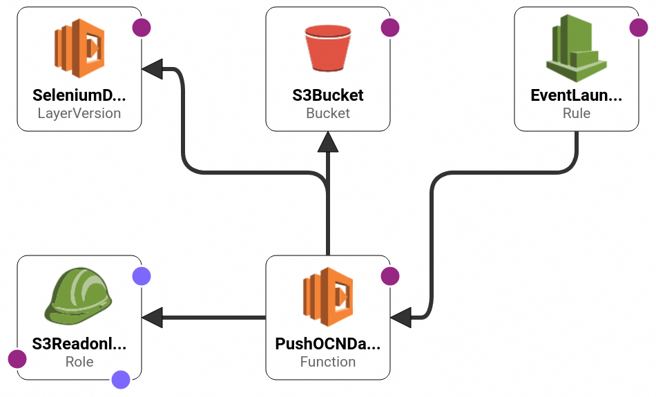

# INDEX
- [ABOUT](#ABOUT)
- [ENVIRONMENT](#ENVIRONMENT)
- [PREPARING](#PREPARING)
- [HOW TO USE](#HOW-TO-USE)
- [REFERENCE](#REFERENCE)
******


# ABOUT


- Using selenium, push [ocn top page](https://www.ocn.ne.jp/) "OCN訪問ポイント" button automatically to get Dpoint.
- OCN site has two factor authentication, but AWS Lambda cannot get SMS Auhentication PIN when running.
- That's why, this Lambda use prepared `cookies.pkl` to login.
- cookies.pkl must have been created by [create_cookies.py](./create_cookies.py) locally and uploaded to S3 beforehand. 


******


# ENVIRONMENT
- python 3.7 (chromium-headless supported version)
- [headless-chromium-amazonlinux-2017-03](https://github.com/adieuadieu/serverless-chrome/releases/download/v1.0.0-55/stable-headless-chromium-amazonlinux-2017-03.zip)
- [chromedriver_linux64](https://chromedriver.storage.googleapis.com/2.43/chromedriver_linux64.zip)
see [requirements.txt](./requirements.txt)
******


# PREPARING
## Common
### AWS CLI
- Create AWS IAM Users for AWS CLI and attached `AdministratorAcess`.
- [install aws cli](https://docs.aws.amazon.com/ja_jp/cli/latest/userguide/getting-started-install.html)
- create ~/.aws/config and paste AccessKey, SecretAccessKey.

```
# ~/.aws/config
[profile default]
region = ap-northeast-1
aws_access_key_id = <<IAM AccessKey>>
aws_secret_access_key = <<IAM SecretAccessKey>>
```

- check connection

```shell
aws s3 ls --profile gr360
```

### python(venv)

```shell
# install python3.7
sudo apt install software-properties-common
sudo add-apt-repository ppa:deadsnakes/ppa
sudo apt install python3.7
 
# install python3.7 venv
sudo apt install python3.7-venv
 
# create python3.7 venv
python3.7 -m venv ~/ocn_daily_login
source ~/ocn_daily_login/bin/activate # activate venv
```

### clone this repository and set up

```shell
# download repository
git clone https://github.com:RyosukeDTomita/ocn_dialy_login_aws_lambda.git

# set up
cd ocn_dialy_login_aws_lambda
pip -r requirements.txt

```

## CloudFormation(WIP)
### AWS SAM settings

> [how to install](https://docs.aws.amazon.com/ja_jp/serverless-application-model/latest/developerguide/install-sam-cli.html)
1. download zip
2. unzip
3. install
4. check

```shell
# install command
sudo ./sam-installation/install
sam --version
```


### build and deploy(WEP)

```shell
sam build
sam deploy --guided
```

```shell
sam delete # delete stack
```
******


## AWS Console(Instead of CloudFormation)

### AWS Lambda
- Create Lambda Basic Excecution IAM role and Add `AmazonS3ReadOnlyAccess`

- create Lambda Layers

```shell
cd create_python_lib_layers
source mk_lambda_layer.sh
cd create_selenium_driver_layers
source mk_driver_lib_layer.sh
```


- paste ./functions/push_ocn_daily_button/app.py
- change lambda settins

|       |       |
|-------|-------|
|timeout|memory |
|1 min  |3007 MB|


### S3 Bucket
- create S3 Bucket to save `cookies.pkl`
> Bucket Name example: cookie-for-iceman

### EventBridge
- Choose `Flexible time window`
> Scheduler invokes your schedule within the time window you specify.
- Cron style schedule settings.

```
0 1 * * ? *
Wed, 09 Aug 2023 01:00:00 (UTC+09:00)
Thu, 10 Aug 2023 01:00:00 (UTC+09:00)
Fri, 11 Aug 2023 01:00:00 (UTC+09:00)
Sat, 12 Aug 2023 01:00:00 (UTC+09:00)
Sun, 13 Aug 2023 01:00:00 (UTC+09:00)
```
******


# HOW TO USE
- create cookies.pkl and upload to S3.

```shell
python3 create_cookies.py --userid <docomo userid> --password <password> --bucket <bucket-name> --profile <aws cli profile>
```
- Then, every 01:00 AM, EventBridge call lambda function and push OCN daily login button.
