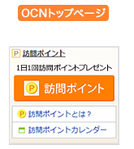

# INDEX
- [ABOUT](#ABOUT)
- [ENVIRONMENT](#ENVIRONMENT)
- [PREPARING](#PREPARING)
- [HOW TO USE](#HOW-TO-USE)
- [REFERENCE](#REFERENCE)

# ABOUT
- Using selenium, push [ocn top page](https://www.ocn.ne.jp/) "OCN訪問ポイント" button automatically to get Dpoint.
- This script can save session information to cookies.pkl




# ENVIRONMENT
- python 3.8
- see [requirements.txt](./requirements.txt)

# PREPARING
1. set up aws cli.

```shell
# download repository
git clone https://github.com:RyosukeDTomita/ocn_dialy_login_aws_lambda.git

# set up
cd ocn_dialy_login_aws_lambda
pip -r requirements.txt
```

# HOW TO USE
WEP

```shell
```
